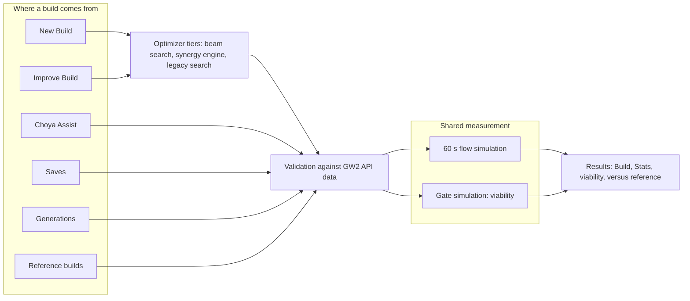

<p align="center">
  
</p>

# GW2 Build Optimizer

[](LICENSE)

An in-game Guild Wars 2 addon for [Nexus](https://raidcore.gg/Nexus) that builds, improves and explains character builds for PvE, PvP and WvW.

GW2 Build Optimizer reads your characters through the official GW2 API. It searches specializations, traits, skills, weapons, gear stats, runes, sigils, relics, food, utility and infusions for the mode, fight size and role you pick. Every candidate is measured in a combat simulator driven by GW2 API data and cited GW2 Wiki records, then compared with your equipped build and with builds published by Snow Crows, Hardstuck and GuildJen. Choya, the chat assistant, lets you ask for a build in your own words through the AI provider you choose.

It is for players who already use Nexus and want a starting build they can check, adjust and paste into the game.


## Contents

- [Requirements](#requirements)
- [Install](#install)
- [First-run setup](#first-run-setup)
- [API keys](#api-keys)
- [Using the overlay](#using-the-overlay)
- [The tabs](#the-tabs)
- [How builds are measured](#how-builds-are-measured)
- [Files on your computer](#files-on-your-computer)
- [What leaves your computer](#what-leaves-your-computer)
- [Troubleshooting](#troubleshooting)
- [Build from source](#build-from-source)
- [License](#license)

## Requirements

- Guild Wars 2 on Windows.
- [Nexus](https://raidcore.gg/Nexus), the Raidcore addon manager ([RaidcoreGG/Nexus](https://github.com/RaidcoreGG/Nexus)).
- A GW2 API key from your ArenaNet account.
- An API key from one AI provider: Google Gemini, OpenRouter, OpenAI or Anthropic. Google and OpenRouter both offer free models.

## Install

1. Install Nexus and start Guild Wars 2 once so the Nexus menu appears.
2. Download the addon from the latest release:
   - [gw2_build_optimizer.dll](https://github.com/special-place-ai-heaven/GW2_Build_Optimizer/releases/latest/download/gw2_build_optimizer.dll)
   - [SHA256SUMS.txt](https://github.com/special-place-ai-heaven/GW2_Build_Optimizer/releases/latest/download/SHA256SUMS.txt), the checksum for that DLL
   - [Release notes](https://github.com/special-place-ai-heaven/GW2_Build_Optimizer/releases/latest)
3. Copy the DLL into the `addons` folder inside your Guild Wars 2 folder.
4. Restart Guild Wars 2. Nexus loads the addon at startup and the setup wizard opens.

> [!IMPORTANT]
> The file must sit directly in `<Guild Wars 2 folder>\addons\`, next to the other Nexus addons, and keep the exact name `gw2_build_optimizer.dll`. A nested folder or a renamed file is not loaded.

To check the download, compare the SHA-256 hash of the DLL with the line in `SHA256SUMS.txt`:

```powershell
Get-FileHash .\gw2_build_optimizer.dll -Algorithm SHA256
```

**Updating.** The addon registers this GitHub repository as its update source with Nexus, so Nexus can offer new releases. You can also replace the DLL by hand with the one from the latest release and restart the game.

**Uninstalling.** Remove the addon in Nexus or delete `gw2_build_optimizer.dll` from the `addons` folder. The addon's own data, including your API keys, stays in `addons\gw2_build_optimizer\` until you delete that folder. The [files table](#files-on-your-computer) lists what is in it.

## First-run setup

Open the overlay from the Nexus Quick Access icon or with **Ctrl+Shift+O**. You can rebind the hotkey in the Nexus keybind settings. The overlay shows a four-step wizard until setup is complete:

1. **Language.** Pick the overlay language.
2. **GW2 key.** Paste your GW2 API key and click Validate. The wizard lists each permission the key carries.
3. **AI key.** Pick a provider, paste its key and validate it.
4. **Game data.** The addon downloads professions, specializations, traits, skills, legends, pets, PvP amulets, item stats, level-80 equipment, food and utility items, icons and, for Deutsch, Español, Français and 简体中文, the official names. Progress is shown step by step. The item catalog resumes where it stopped if the download is interrupted. Its length depends on the GW2 API rate limit the addon respects: 300 requests in a burst, then 5 per second.

Setup counts as complete only when a GW2 key, a key for the active AI provider and the game data are all present.

Installs whose item catalog predates food and utility support run a one-off backfill on the next **Refresh Game Data**. It shows as "Items (food and utility)" and does not repeat once the rows exist.

## API keys

### GW2 API key (mandatory)

Create a key at <https://account.arena.net/applications>: sign in, choose **New Key**, give it any name and tick these permissions.

| Permission | Needed | Used for |
|---|---|---|
| `account` | Yes | Key check, and your account name if you choose to attach it to a message to the developer |
| `characters` | Yes | Your character list |
| `builds` | Yes | Build tabs and equipment tabs of each character |
| `inventories`, `unlocks` | No | The wizard lists them as recommended, but this version calls no endpoint that needs them |

The wizard refuses a key that lacks one of the three required permissions and names the missing ones.

### AI provider key (mandatory for setup)

You need a key from one provider. You can switch provider and model at any time in Settings.

| Provider | Where to get a key | Cost |
|---|---|---|
| Google Gemini | <https://aistudio.google.com/apikey> | Most Flash and Flash-Lite models and Gemini 2.5 Pro have a free tier. Sign in with Google, create an API key, pick any project. |
| OpenRouter | <https://openrouter.ai/keys> | One key for many models, including free ones (model ids ending in `:free`). No credits are needed for free models. |
| OpenAI | <https://platform.openai.com/api-keys> | Needs billing set up on the account. |
| Anthropic | <https://console.anthropic.com/settings/keys> | Needs billing set up on the account. |

**Free models.** The model picker in Settings has a **Free** filter that is on by default. Google's free tier allows about 5 requests per minute per model. When a request hits that limit, the addon waits for the next free slot and shows a countdown instead of failing. OpenRouter hides some free models unless your workspace guardrail allows free endpoints that train on prompts. The Settings tab links the page where you change that.

**Key check.** Validation separates a wrong key from a billing problem. A rejected key reads as invalid. A key that works but hits a quota or billing limit is accepted with a warning, so you can fix the account instead of replacing the key.

**What the AI does.**

- **New Build and Improve Build** do not depend on the AI. The search and the scoring run in the addon. If a key is set, the model may suggest changes to the best build, and each suggestion is kept only if it scores higher. It also writes the explanation text. If the model fails or is unavailable, the run still ends in a build.
- **Choya Assist** needs a working key. The model proposes a build. The addon checks every name against the game data, fixes or refuses illegal picks, and measures the result. If the model does not answer, Choya shows the optimizer's own build for the same request.

**Cost.** Every run records its token count and a cost estimate, shown in USD or EUR (Settings, "Cost estimates in"). The estimate multiplies tokens by list prices from a bundled price table, or uses the cost the provider reports. A model with no price row shows "cost n/a". OpenRouter `:free` models count as zero. The table does not know whether your Gemini key is on the free tier, so free Gemini requests are still priced at the paid list rate.

> [!WARNING]
> Choya and the AI step of New Build and Improve send your request to the provider you chose. The request includes the mode, scale and role, your character's build and gear, the build on the results tab, pasted chat codes and the recent chat messages. That provider's terms and prices apply. Your API keys are stored unencrypted in `config.json` in the addon folder. Do not share that file.

## Using the overlay

**Left rail.** Pick a character, its build tab and its equipment tab. Then pick:

- **Mode:** PvE, PvP or WvW.
- **Scale:** Roam, Havoc or Cloud/Zerg in WvW. Open World, Group or Squad in PvE. PvP has no scale.
- **Role:** WvW offers Roamer, Damage, Bruiser, Troll, Support, Disable and Commander. PvE offers Damage, Condi, Support, Heal and Tank. PvP offers Damage, Roamer, Bruiser, Support and Disable. Hover a chip for its meaning.
- **Fine-tune weights:** a radar with six axes: Power, Condition, Boon Support, Heal, Sustain and Control. Drag a point to change how much that goal counts. The radar overlays the current and the optimized build.

The line under the chips repeats your intent as mode · scale · role. The action button reads "Optimize: <role>".

**Results pane.** Results appear as tabs: **Current** for the equipped build, one tab per candidate build, and one tab per synced reference build. Each result has a **Build** view and a **Stats** view:

- **Build** shows skills, specializations and traits, armor, trinkets and weapons with their stats, runes, sigils and relic.
- **Stats** shows attributes, damage, modifiers, boons, conditions and the simulated rotation with its skill usage. It also compares Solo, Party and Full Squad buff levels.
- **Viability report** gives a VIABLE or NON-VIABLE verdict with the reasons, such as too few stunbreaks or too little cleansing in WvW and PvP.
- **Versus reference** gives a meter against the closest published build as a percentage, from on-par to far below. When no reference exists for your role, the meter compares against another role and is labelled "Different role: not a like-for-like comparison".
- **Not simulated** names every trait, skill or effect the simulator could not play for this build, marked Provisional.

**Run feed.** While a run is working, its steps appear live: each search tier, fallbacks with their reason, each AI request with its tokens, quota waits, validation and the final measurement. A pill at the right of the results tabs shows duration, model, tokens and estimated cost. Its tooltip splits AI wait time from compute time. After the run, the steps stay available as a collapsible **Run log**. Hover any number in the feed for an explanation of what it counts.

**Chat code.** The strip at the top of the overlay holds a GW2 build template. Click it to copy the code to the Windows clipboard, then use **Paste Build Template** in the Hero panel. It shows "Chat · Character" for the equipped build and "Chat · Optimized" for a result. A chat code carries profession, specializations, traits, skills and weapons, not gear stats.

## The tabs

### New Build

Pick a character, mode, scale and role, then click Optimize. The optimizer runs up to three tiers. A beam search keeps the best complete builds and changes one piece at a time. If it fails, a synergy engine picks each piece in turn. If that also fails, an older stat-prefix search runs. Each tier falls back to the next and the run log says why. Food, utility and infusions are chosen for each finished build before it is ranked.

### Improve Build

Starts from the selected character's equipped build and gear. The **Spec & Trait Locks** panel shows specializations and their trait grid. Click a specialization or a trait to lock it, or use Lock All and Unlock All. Opening the tab locks the equipped elite specialization. Gear stat prefixes can be locked on the gear sheet. Your current build is scored by the same judge as every candidate. If nothing ranks above it, the addon keeps your build and says so rather than offering a worse one.

### Choya Assist


Describe the build you want, or ask Choya to fix the selected character. Starter prompts cover common requests, and you can paste GW2 chat codes. Choya's thinking bubble shows the live steps with **Stop** and **Retry**. An accepted answer becomes a full build card with stats. The card opens on Improve Build when a character is loaded, and on New Build otherwise. The chat history is kept between sessions.

### Saves

Name a result and save it. Saved builds are grouped by character, carry an optional note, and can be loaded, replaced or deleted. Loading a save measures it again with the current game data, the same way as any other result. Saves are addon files, not GW2 account templates.

### News

Hidden until you turn on at least one source in Settings. The sources are the official Guild Wars 2 site, forum news, patch notes, ArenaNet on YouTube and GuildJen guides. Layouts are Compact, Card and Detail, and a filter narrows the page to articles, notes, videos or guides. The overlay shows text and still images. Videos open in your browser.

### Choya Tunes

An internet radio player that keeps playing while you fight. It searches the radio-browser.info directory by name, 16 genres, language, 34 countries and a bitrate cap. With language on Auto it follows the overlay language. You can keep favourites, and the last station and volume are remembered. Other features:

- **Lower volume in combat** reads the combat state from the game's Mumble link.
- **AI quips** is off by default. When on, it sends the current song title to your AI provider, at most 30 requests a day.
- A Nexus keybind for pause and resume is available, unbound by default.

HLS streams and OGG, FLAC and Opus stations are not offered.

### Settings

| Section | What it holds |
|---|---|
| AI provider | Provider, key entry and Test button, model picker with search and the Free filter, requests used today |
| Optimization defaults | Default mode, scale and role at startup |
| Data quality legend | Verified, Provisional and Blocked, as shown on results |
| News | Sources, layout, stills on or off |
| Cache & data | Game build number, cache size, Refresh Game Data, Clear Cache, Reset Setup |
| UI preferences | Language, font, window opacity, global scale, cost currency (USD or EUR) |
| Theme | Five presets (Tyrian Gold, Glacial Ward, Verdant Wilds, Molten Ember, Void Orchid) or a custom theme from five base colors |
| Layout tuning | Left panel width, padding, spacing, indent |
| Benchmark data | Sync Benchmarks, which downloads published builds from Snow Crows (PvE), Hardstuck and GuildJen (WvW and PvP) |

The overlay is available in English, Deutsch, Español, Français, Italiano, Português, Nederlands, Polski, Русский, 简体中文, 日本語 and 한국어. Skill, trait and item names follow the official GW2 API translations for Deutsch, Español, Français and 简体中文, and stay in English for the other languages.

Reference builds appear on the results only after a sync. A full sync fetches several hundred pages and takes minutes. It pauses by itself when a site asks it to slow down.

### About

- **What's new** shows the release notes bundled with the DLL.
- **Messages** lists what you sent to the developer, its status (Received, Read, Answered, Closed) and any reply. The About tab pulses when a reply arrives.
- **Message developer** is a short form to report a bug or a wrong build, suggest something, ask a question, or send Choya a fistbump. A send that fails is kept with a Resend button.
- **Generations** is a table of every New Build, Improve and Choya run. It shows date, type, character, scenario, model, duration, tokens, cost and a mini build card. You can filter by type, character, mode, model, date range or free text, sort by column and page through the rows. You can also expand a row to see its run log. Clicking a build card restores that character, mode, scale, role and weights, measures the build again and opens it on the matching tab.

## How builds are measured

Every tab measures a build the same way. New Build, Improve Build, Choya Assist, Saves, Generations and the reference-build tabs all hand a validated build to one shared measurement. The same build in the same scenario therefore shows the same numbers wherever you open it.



**What it models.**

- **Stat sheet.** Attributes come from the real items, stat prefixes, runes, sigils, relic, infusions, food and utility, traits and profession, using the GW2 attribute formulas.
- **Flow simulation.** The build's rotation plays for 60 seconds against a training dummy set up for the scenario. The dummy is not a real opponent. The simulation includes auto-attack chains, weapon swaps, forms such as Necromancer shroud and Druid Celestial Avatar, boons and conditions with their durations and stack limits, and damage modifiers.
- **Trigger records.** Traits, sigils, relics and some skills fire effect records from `data/normalized_effects`. Each record cites the GW2 Wiki page it was taken from. Coverage is uneven: the WvW file holds far more records than PvE or PvP.
- **Viability gates.** In WvW and PvP, a build must clear floors such as stunbreak count, stability or other cover against control, condition cleanse rate and effective health. In WvW it must also recover after the exchange and pay its resource costs. Failing one of these marks the build non-viable, and it ranks below every viable build. Other WvW checks, such as finishing a protected attack sequence, are reported as concerns and do not veto a build.

**What it does not model yet.**

- Pets as damage or boon sources, and some elite transforms and kits: Photon Forge, Tempest overloads and Lich Form.
- Allies. The simulation is self-only. Party and squad boons are fixed buff levels on the Stats view, not other players.
- Misses, evades, disruption and target movement. The simulated build hits its target the whole time.
- Traits whose effect has no record or needs a mechanic the simulator lacks. These are named on the Not simulated line of each result.

**Accuracy.** Treat every number as an estimate, not a benchmark. The developer compares the simulator with arcdps combat logs parsed by Elite Insights, using the `log_compare` example in this repository. In the latest measurements the simulated damage is lower than the logged damage, at roughly half to four-fifths of it. Use the ranking and the reference comparison to choose between builds, then confirm in game.

## Files on your computer

Everything lives in `addons\gw2_build_optimizer\` inside your Guild Wars 2 folder.

| Path | Contents |
|---|---|
| `config.json` | Settings and API keys (unencrypted), plus a random per-install id used only to match replies to your messages |
| `cache\` | Downloaded game data, icons, character data, news stills and radio station logos |
| `saves\` | Your saved builds |
| `generations.jsonl` | One line per run, read by the Generations table. Past 20 MB it is moved to `generations.1.jsonl`. |
| `kitchen.json` | Choya chat history |
| `messages.json` | Your messages to the developer and their replies. Delete it to clear the list. |
| `benchmarks\` | Synced reference builds |
| `models_dev.json`, `model_profiles.json`, `*_usage.json` | Model catalog, per-model behaviour notes, per-provider request counters |

## What leaves your computer

| Destination | When | What is sent |
|---|---|---|
| `api.guildwars2.com`, `render.guildwars2.com` | Setup, refresh, character loads, a periodic status check | Your GW2 API key for account requests. Game data and icons are fetched without it. |
| Your AI provider | Choya, the AI step of New Build and Improve, key tests, AI quips | Your request and build context, as described in the warning under [API keys](#api-keys) |
| `models.dev` | Each game start | A download of the public model catalog. Nothing about you is sent. |
| Snow Crows, Hardstuck, GuildJen | Only when you click Sync Benchmarks | Page requests |
| News sites and YouTube thumbnails | Only for sources you turn on | Page and image requests |
| radio-browser.info and the station | Only when you use Choya Tunes | Directory searches and the audio stream |
| `feedback.robagentic.tech` | Only when you send a message from About | See below |

**Messages to the developer.** A message holds the category, your text, the addon version, game build, overlay language, mode, scale, role, the current profession and elite specialization, and the name of your AI provider. Three things are optional and off by default: a contact line, your GW2 account name, and for wrong-build reports a slim copy of your last result. That copy covers stat prefixes, specializations and traits, weapons, sigils, skills, rune, relic and chat code. API keys and character names are never sent. The contact line is stored on the server in plain text, and the server has no automatic deletion.

## Troubleshooting

**The addon does not appear.** Check that Nexus works, that the file is named exactly `gw2_build_optimizer.dll` and sits directly in `addons\`, and that you restarted the game after copying it.

**"Game data stale" next to the status line.** ArenaNet shipped a new game build. Click **Refresh** there, or **Refresh Game Data** in Settings. Icons stay cached. Clear Cache is only needed to download everything again from scratch.

**"Names still English."** The official names for your language are missing or out of date. Refresh Game Data downloads them.

**The GW2 key is refused.** Create a new key with at least `account`, `characters` and `builds`.

**AI errors.** Use Test in Settings.

- "API key rejected" means the key is wrong.
- "Billing or quota issue" means the key works but the account needs attention.
- "Rate limited" means wait a minute or pick another model.
- A slow free model can time out. Try a different one.

**A result looks wrong.** Check mode, scale and role, drop locks you do not need, and read the viability reasons and the Not simulated line. Then report it from About with **Message developer**, category Wrong build, and attach your last result.

**Logs.** Warnings and fallbacks go to the Nexus log. The run log of each optimization is kept in the Generations table.

Bug reports and questions go through **About > Message developer** or the repository's [issues](https://github.com/special-place-ai-heaven/GW2_Build_Optimizer/issues).

## Build from source

You need a Rust toolchain on Windows. CI builds on `windows-latest`.

```powershell
cargo build --release
```

This writes `target\release\gw2_build_optimizer.dll`. Copy it into your `addons` folder.

Checks, as run in CI:

```powershell
cargo fmt --all --check
cargo clippy --workspace --all-targets -- -D warnings
cargo test --workspace
```

The examples and live-cache tests need to know where the game is. Copy `dev.cfg.example` to `dev.cfg`, which git ignores, and set `addons_dir`. The addon itself never reads this file. For example, the fidelity instrument compares the simulator with an Elite Insights JSON log:

```powershell
cargo run -p gw2-optimizer --example log_compare -- <log.json or folder>
```

The workspace has four crates:

| Crate | Role |
|---|---|
| `crates/addon` | The Nexus DLL: overlay UI, tabs, radio, feedback client |
| `crates/core` | Config, storage, shared types, translations, generation records |
| `crates/gw2api` | GW2 API v2 client, rate limiter, cache and download |
| `crates/optimizer` | Search, simulator, scoring, validation, AI providers, reference-build sync |

Contributor notes are in [CLAUDE.md](CLAUDE.md), and design and audit documents are under [docs/](docs/).

## License

[MIT](LICENSE). Free to use. If it saved you gold, Choya takes coffee at <https://ko-fi.com/specialplacerob>.
